# New Powerful Table For HIUI

## 使用

```bash
npm i @hi-ui/hi-table --save
// or
yarn add @hi-ui/hi-table
```

```jsx
import Table from '@hi-ui/hi-table'
render(<Table columns={columns} data={data} />, document.getElementById('app'))
```

## demo 演示

```bash
git clone micode@micode.be.xiaomi.com:hiui/table-engine.git

npm i

npm start

# watch in http://localhost:3000

```

## 功能

**当前已支持如下功能**

- 基础用法
- 列对齐调整
- 斑马线
- 整行数据异常
- 行批量操作
- 行高亮
- 求和、平均数
- 列高亮
- 带边框
- 不同尺寸
- 列操作（高亮、冻结、排序）
- 分页
- 吸顶
- 树形
- 合并单元格
- 固定表头
- 列冻结
- 表头分组
- 内嵌式
- 服务端表格
- 动态调整列宽
- 控制面板集成（支持列顺序调整、隐藏列）
- 标准模式

### 基础用法


需要传入 `columns` 和 `data` 来完成表格的渲染

```js
import Table from '@mi/power-table'
import React from 'react'

let columns = [
  {
    title: '商品名',
    dataKey: 'name'
  },
  {
    title: '品类',
    dataKey: 'type'
  },
  {
    title: '规格',
    dataKey: 'size'
  },
  {
    title: '单价',
    dataKey: 'price'
  },
  {
    title: '门店',
    dataKey: 'address'
  },
  {
    title: '库存',
    dataKey: 'stock'
  }
]

let data = [
  {
    name: '小米9',
    type: '手机',
    size: '6G+64G 全息幻彩蓝',
    price: '3299.00',
    address: '华润五彩城店',
    stock: '29,000',
    key: 1
  },
  {
    name: '小米9 SE',
    type: '手机',
    size: '6G+64G 全息幻彩蓝',
    price: '1999.00',
    address: '清河店',
    stock: '10,000',
    key: 2
  },
  {
    name: '小米8',
    type: '手机',
    size: '6G+64G 全息幻彩蓝',
    price: '2599.00',
    address: '双安店',
    stock: '12,000',
    key: 3
  },
  {
    name: 'Redmi Note7',
    type: '手机',
    size: '6G+64G 全息幻彩蓝',
    price: '999.00',
    address: '华润五彩城店',
    stock: '140,000',
    key: 4
  },
  {
    name: '小米8 SE',
    type: '手机',
    size: '6G+64G 全息幻彩蓝',
    price: '699.00',
    address: '双安店',
    stock: '12,000',
    key: 5
  }
]

const NormalTable = () => {
  return <Table columns={columns} data={data} />
}

export default NormalTable
```

### 列对齐

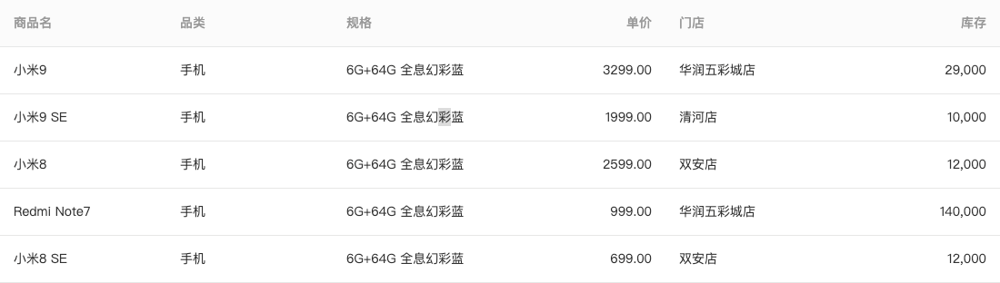

通过设置 `columns` 中列的 `align` 来调整列的对齐方式

```js
import Table from '@mi/power-table'
import React from 'react'

let columns = [
  {
    title: '商品名',
    dataKey: 'name'
  },
  {
    title: '品类',
    dataKey: 'type'
  },
  {
    title: '规格',
    dataKey: 'size'
  },
  {
    title: '单价',
    dataKey: 'price',
    align: 'right'
  },
  {
    title: '门店',
    dataKey: 'address'
  },
  {
    title: '库存',
    dataKey: 'stock',
    align: 'right'
  }
]

let data = [
  {
    name: '小米9',
    type: '手机',
    size: '6G+64G 全息幻彩蓝',
    price: '3299.00',
    address: '华润五彩城店',
    stock: '29,000',
    key: 1
  },
  {
    name: '小米9 SE',
    type: '手机',
    size: '6G+64G 全息幻彩蓝',
    price: '1999.00',
    address: '清河店',
    stock: '10,000',
    key: 2
  },
  {
    name: '小米8',
    type: '手机',
    size: '6G+64G 全息幻彩蓝',
    price: '2599.00',
    address: '双安店',
    stock: '12,000',
    key: 3
  },
  {
    name: 'Redmi Note7',
    type: '手机',
    size: '6G+64G 全息幻彩蓝',
    price: '999.00',
    address: '华润五彩城店',
    stock: '140,000',
    key: 4
  },
  {
    name: '小米8 SE',
    type: '手机',
    size: '6G+64G 全息幻彩蓝',
    price: '699.00',
    address: '双安店',
    stock: '12,000',
    key: 5
  }
]

const AlignTable = () => {
  return <Table columns={columns} data={data} />
}

export default AlignTable
```

### 斑马线

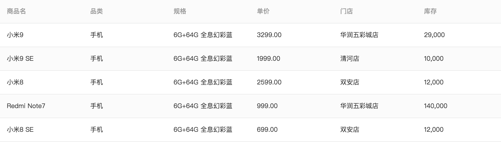

通过配置属性 `stripled` 来使表格的行带有斑马纹一样的深浅间隔

```js
import Table from '@mi/power-table'
import React from 'react'
let columns = [
  {
    title: '商品名',
    dataKey: 'name'
  },
  {
    title: '品类',
    dataKey: 'type'
  },
  {
    title: '规格',
    dataKey: 'size'
  },
  {
    title: '单价',
    dataKey: 'price'
  },
  {
    title: '门店',
    dataKey: 'address'
  },
  {
    title: '库存',
    dataKey: 'stock'
  }
]

let data = [
  {
    name: '小米9',
    type: '手机',
    size: '6G+64G 全息幻彩蓝',
    price: '3299.00',
    address: '华润五彩城店',
    stock: '29,000',
    key: 1
  },
  {
    name: '小米9 SE',
    type: '手机',
    size: '6G+64G 全息幻彩蓝',
    price: '1999.00',
    address: '清河店',
    stock: '10,000',
    key: 2
  },
  {
    name: '小米8',
    type: '手机',
    size: '6G+64G 全息幻彩蓝',
    price: '2599.00',
    address: '双安店',
    stock: '12,000',
    key: 3
  },
  {
    name: 'Redmi Note7',
    type: '手机',
    size: '6G+64G 全息幻彩蓝',
    price: '999.00',
    address: '华润五彩城店',
    stock: '140,000',
    key: 4
  },
  {
    name: '小米8 SE',
    type: '手机',
    size: '6G+64G 全息幻彩蓝',
    price: '699.00',
    address: '双安店',
    stock: '12,000',
    key: 5
  }
]

const ZebraTable = () => {
  return <Table columns={columns} data={data} striped />
}

export default ZebraTable
```

### 整行数据异常

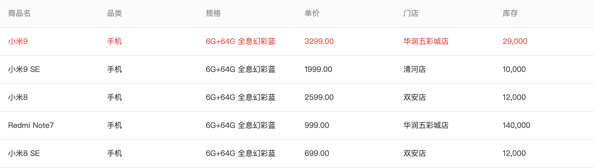

通过配置 `errorRowKeys` 来对表格的行进行异常标示

```js
import Table from '@mi/power-table'
import React from 'react'

let columns = [
  {
    title: '商品名',
    dataKey: 'name'
  },
  {
    title: '品类',
    dataKey: 'type'
  },
  {
    title: '规格',
    dataKey: 'size'
  },
  {
    title: '单价',
    dataKey: 'price'
  },
  {
    title: '门店',
    dataKey: 'address'
  },
  {
    title: '库存',
    dataKey: 'stock'
  }
]

let data = [
  {
    name: '小米9',
    type: '手机',
    size: '6G+64G 全息幻彩蓝',
    price: '3299.00',
    address: '华润五彩城店',
    stock: '29,000',
    key: 1
  },
  {
    name: '小米9 SE',
    type: '手机',
    size: '6G+64G 全息幻彩蓝',
    price: '1999.00',
    address: '清河店',
    stock: '10,000',
    key: 2
  },
  {
    name: '小米8',
    type: '手机',
    size: '6G+64G 全息幻彩蓝',
    price: '2599.00',
    address: '双安店',
    stock: '12,000',
    key: 3
  },
  {
    name: 'Redmi Note7',
    type: '手机',
    size: '6G+64G 全息幻彩蓝',
    price: '999.00',
    address: '华润五彩城店',
    stock: '140,000',
    key: 4
  },
  {
    name: '小米8 SE',
    type: '手机',
    size: '6G+64G 全息幻彩蓝',
    price: '699.00',
    address: '双安店',
    stock: '12,000',
    key: 5
  }
]
const RowErrorTable = () => {
  return <Table columns={columns} data={data} errorRowKeys={[1]} />
}

export default RowErrorTable
```

### 行批量操作

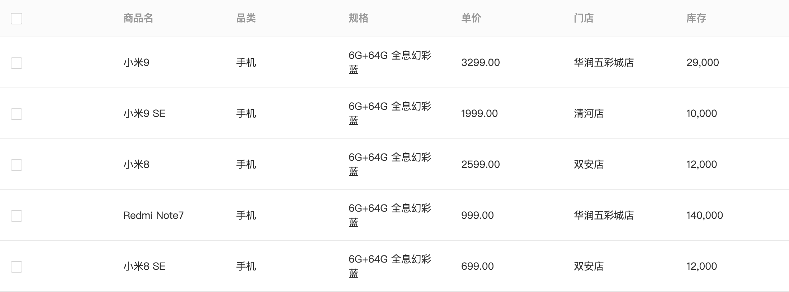

通过配置 `rowSelection` 使表格可以批量选中

```js
import Table from '@mi/power-table'
import React, { useState } from 'react'

let columns = [
  {
    title: '商品名',
    dataKey: 'name'
  },
  {
    title: '品类',
    dataKey: 'type'
  },
  {
    title: '规格',
    dataKey: 'size'
  },
  {
    title: '单价',
    dataKey: 'price'
  },
  {
    title: '门店',
    dataKey: 'address'
  },
  {
    title: '库存',
    dataKey: 'stock'
  }
]

let data = [
  {
    name: '小米9',
    type: '手机',
    size: '6G+64G 全息幻彩蓝',
    price: '3299.00',
    address: '华润五彩城店',
    stock: '29,000',
    key: 1
  },
  {
    name: '小米9 SE',
    type: '手机',
    size: '6G+64G 全息幻彩蓝',
    price: '1999.00',
    address: '清河店',
    stock: '10,000',
    key: 2
  },
  {
    name: '小米8',
    type: '手机',
    size: '6G+64G 全息幻彩蓝',
    price: '2599.00',
    address: '双安店',
    stock: '12,000',
    key: 3
  },
  {
    name: 'Redmi Note7',
    type: '手机',
    size: '6G+64G 全息幻彩蓝',
    price: '999.00',
    address: '华润五彩城店',
    stock: '140,000',
    key: 4
  },
  {
    name: '小米8 SE',
    type: '手机',
    size: '6G+64G 全息幻彩蓝',
    price: '699.00',
    address: '双安店',
    stock: '12,000',
    key: 5
  }
]

const RowSelectionTable = () => {
  const [selectedRowKeys, setSelectedRowKeys] = useState([])
  return (
    <Table
      columns={columns}
      data={data}
      rowSelection={{
        selectedRowKeys: selectedRowKeys,
        onChange: selectedRowKeys => {
          setSelectedRowKeys(selectedRowKeys)
        }
      }}
    />
  )
}

export default RowSelectionTable
```

### 行高亮


通过控制 `highlightedRowKeys` 来控制表格需要高亮显示的行，同时表格自带双击行高亮和双击取消行高亮。需要注意的是，通过 `highlightedRowKeys` 配置的行高亮，不受双击影响。

```js
import Table from '../HiTable'
import React from 'react'

let columns = [
  {
    title: '商品名',
    dataKey: 'name'
  },
  {
    title: '品类',
    dataKey: 'type'
  },
  {
    title: '规格',
    dataKey: 'size'
  },
  {
    title: '单价',
    dataKey: 'price'
  },
  {
    title: '门店',
    dataKey: 'address'
  },
  {
    title: '库存',
    dataKey: 'stock'
  }
]

let data = [
  {
    name: '小米9',
    type: '手机',
    size: '6G+64G 全息幻彩蓝',
    price: '3299.00',
    address: '华润五彩城店',
    stock: '29,000',
    key: 1
  },
  {
    name: '小米9 SE',
    type: '手机',
    size: '6G+64G 全息幻彩蓝',
    price: '1999.00',
    address: '清河店',
    stock: '10,000',
    key: 2
  },
  {
    name: '小米8',
    type: '手机',
    size: '6G+64G 全息幻彩蓝',
    price: '2599.00',
    address: '双安店',
    stock: '12,000',
    key: 3
  },
  {
    name: 'Redmi Note7',
    type: '手机',
    size: '6G+64G 全息幻彩蓝',
    price: '999.00',
    address: '华润五彩城店',
    stock: '140,000',
    key: 4
  },
  {
    name: '小米8 SE',
    type: '手机',
    size: '6G+64G 全息幻彩蓝',
    price: '699.00',
    address: '双安店',
    stock: '12,000',
    key: 5
  }
]
const RowErrorTable = () => {
  return <Table columns={columns} data={data} highlightedRowKeys={[1]} />
}

export default RowErrorTable
```

### 求和与平均数

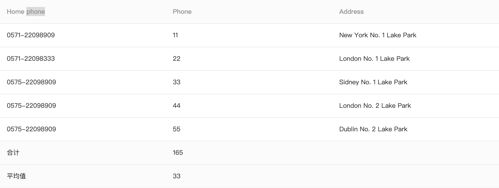

通过在 `columns` 中配置列的 `avg` 和 `sum` 来开启求和与平均数的展示

```js
import Table from '../HiTable'
import React from 'react'

let columns = [
  {
    title: 'Home phone',
    colSpan: 2,
    dataKey: 'tel'
  },
  {
    title: 'Phone',
    colSpan: 0,
    dataKey: 'phone',
    avg: true,
    sum: true
  },
  {
    title: 'Address',
    dataKey: 'address'
  }
]

let data = [
  {
    key: '1',
    name: 'John Brown',
    age: 32,
    tel: '0571-22098909',
    phone: 11,
    address: 'New York No. 1 Lake Park'
  },
  {
    key: '2',
    name: 'Jim Green',
    tel: '0571-22098333',
    phone: 22,
    age: 42,
    address: 'London No. 1 Lake Park'
  },
  {
    key: '3',
    name: 'Joe Black',
    age: 32,
    tel: '0575-22098909',
    phone: 33,
    address: 'Sidney No. 1 Lake Park'
  },
  {
    key: '4',
    name: 'Jim Red',
    age: 18,
    tel: '0575-22098909',
    phone: 44,
    address: 'London No. 2 Lake Park'
  },
  {
    key: '5',
    name: 'Jake White',
    age: 18,
    tel: '0575-22098909',
    phone: 55,
    address: 'Dublin No. 2 Lake Park'
  }
]

class App extends React.Component {
  state = {
    data: datas
  }
  render() {
    return (
      <Table columns={columns} data={this.state.data} errorRows={['4', '5']} />
    )
  }
}

export default App
```

### 列高亮

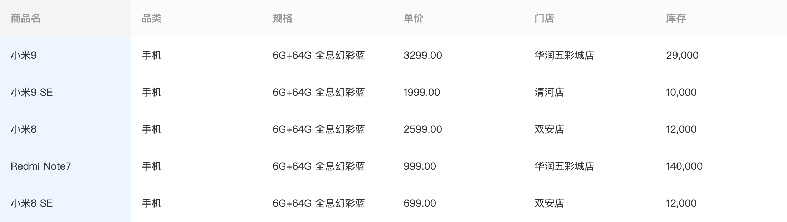

通过配置 `highlightedColKeys` 来控制表格列的高亮

```js
import Table from '../HiTable'
import React from 'react'

let columns = [
  {
    title: '商品名',
    dataKey: 'name'
  },
  {
    title: '品类',
    dataKey: 'type'
  },
  {
    title: '规格',
    dataKey: 'size'
  },
  {
    title: '单价',
    dataKey: 'price'
  },
  {
    title: '门店',
    dataKey: 'address'
  },
  {
    title: '库存',
    dataKey: 'stock'
  }
]

let data = [
  {
    name: '小米9',
    type: '手机',
    size: '6G+64G 全息幻彩蓝',
    price: '3299.00',
    address: '华润五彩城店',
    stock: '29,000',
    key: 1
  },
  {
    name: '小米9 SE',
    type: '手机',
    size: '6G+64G 全息幻彩蓝',
    price: '1999.00',
    address: '清河店',
    stock: '10,000',
    key: 2
  },
  {
    name: '小米8',
    type: '手机',
    size: '6G+64G 全息幻彩蓝',
    price: '2599.00',
    address: '双安店',
    stock: '12,000',
    key: 3
  },
  {
    name: 'Redmi Note7',
    type: '手机',
    size: '6G+64G 全息幻彩蓝',
    price: '999.00',
    address: '华润五彩城店',
    stock: '140,000',
    key: 4
  },
  {
    name: '小米8 SE',
    type: '手机',
    size: '6G+64G 全息幻彩蓝',
    price: '699.00',
    address: '双安店',
    stock: '12,000',
    key: 5
  }
]
const RowHighlightedTable = () => {
  return <Table columns={columns} data={data} highlightedColKeys={['name']} />
}

export default RowHighlightedTable
```

### 带边框

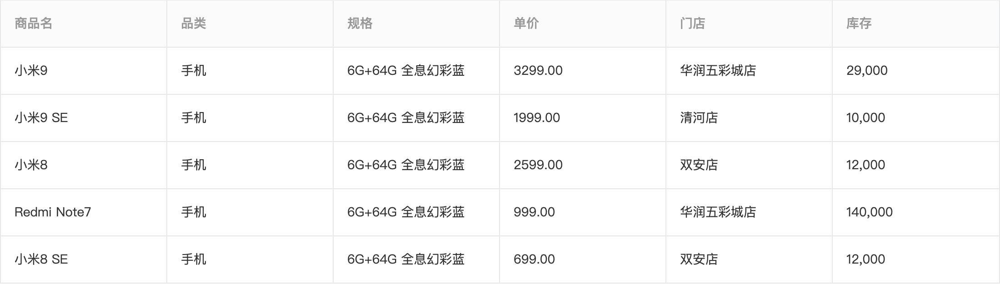

通过配置 `bordered` 来使表格带边框展示

```js
import Table from '../HiTable'
import React from 'react'

let columns = [
  {
    title: '商品名',
    dataKey: 'name'
  },
  {
    title: '品类',
    dataKey: 'type'
  },
  {
    title: '规格',
    dataKey: 'size'
  },
  {
    title: '单价',
    dataKey: 'price'
  },
  {
    title: '门店',
    dataKey: 'address'
  },
  {
    title: '库存',
    dataKey: 'stock'
  }
]

let data = [
  {
    name: '小米9',
    type: '手机',
    size: '6G+64G 全息幻彩蓝',
    price: '3299.00',
    address: '华润五彩城店',
    stock: '29,000',
    key: 1
  },
  {
    name: '小米9 SE',
    type: '手机',
    size: '6G+64G 全息幻彩蓝',
    price: '1999.00',
    address: '清河店',
    stock: '10,000',
    key: 2
  },
  {
    name: '小米8',
    type: '手机',
    size: '6G+64G 全息幻彩蓝',
    price: '2599.00',
    address: '双安店',
    stock: '12,000',
    key: 3
  },
  {
    name: 'Redmi Note7',
    type: '手机',
    size: '6G+64G 全息幻彩蓝',
    price: '999.00',
    address: '华润五彩城店',
    stock: '140,000',
    key: 4
  },
  {
    name: '小米8 SE',
    type: '手机',
    size: '6G+64G 全息幻彩蓝',
    price: '699.00',
    address: '双安店',
    stock: '12,000',
    key: 5
  }
]

const BorderedTable = () => {
  return <Table columns={columns} data={data} bordered />
}
export default BorderedTable
```

### 不同尺寸的表格

通过设置 `size` 来使表格按照不同尺寸进行展示

```js
import Table from '../HiTable'
import React from 'react'

let columns = [
  {
    title: 'Name',
    dataKey: 'name',
    key: 1
  },
  {
    title: 'Age',
    dataKey: 'age',
    key: 2
  },
  {
    title: 'Home phone',
    colSpan: 2,
    dataKey: 'tel',
    key: 3
  },
  {
    title: 'Phone',
    colSpan: 0,
    dataKey: 'phone',
    key: 4
  },
  {
    title: 'Address',
    dataKey: 'address',
    key: 5
  }
]

let data = [
  {
    key: '1',
    name: 'John Brown',
    age: 32,
    tel: '0571-22098909',
    phone: 18889898989,
    address: 'New York No. 1 Lake Park'
  },
  {
    key: '2',
    name: 'Jim Green',
    tel: '0571-22098333',
    phone: 18889898888,
    age: 42,
    address: 'London No. 1 Lake Park'
  },
  {
    key: '3',
    name: 'Joe Black',
    age: 32,
    tel: '0575-22098909',
    phone: 18900010002,
    address: 'Sidney No. 1 Lake Park'
  },
  {
    key: '4',
    name: 'Jim Red',
    age: 18,
    tel: '0575-22098909',
    phone: 18900010002,
    address: 'London No. 2 Lake Park'
  },
  {
    key: '5',
    name: 'Jake White',
    age: 18,
    tel: '0575-22098909',
    phone: 18900010002,
    address: 'Dublin No. 2 Lake Park'
  }
]

export default function() {
  return <Table columns={columns} data={data} size='large' />
}
```

### 列操作

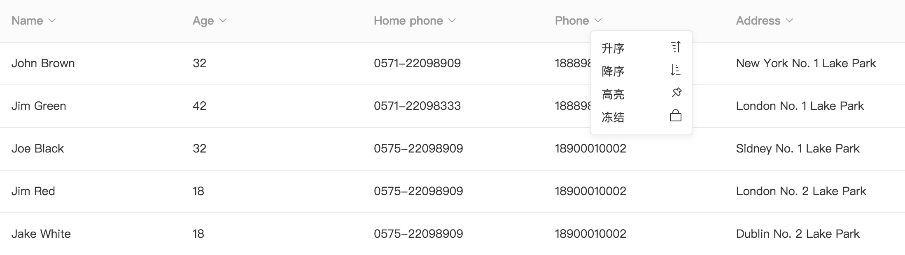

通过配置 `showColMenu` 来开启列操作功能，默认自带列高亮和列冻结功能，当在 `columns` 中的列配置了 `sorter` 函数，列操作将会具备排序功能

```js
import Table from '../HiTable'
import React from 'react'

let columns = [
  {
    title: 'Name',
    dataKey: 'name',
    key: 1
  },
  {
    title: 'Age',
    dataKey: 'age',
    key: 2,
    sorter(pre, next) {
      return pre.age - next.age
    }
  },
  {
    title: 'Home phone',
    colSpan: 2,
    dataKey: 'tel',
    key: 3
  },
  {
    title: 'Phone',
    dataKey: 'phone',
    key: 4,
    sorter(pre, next) {
      return pre.phone - next.phone
    }
  },
  {
    title: 'Address',
    dataKey: 'address',
    key: 5
  }
]

let data = [
  {
    key: '1',
    name: 'John Brown',
    age: 32,
    tel: '0571-22098909',
    phone: 18889898989,
    address: 'New York No. 1 Lake Park'
  },
  {
    key: '2',
    name: 'Jim Green',
    tel: '0571-22098333',
    phone: 18889898888,
    age: 42,
    address: 'London No. 1 Lake Park'
  },
  {
    key: '3',
    name: 'Joe Black',
    age: 32,
    tel: '0575-22098909',
    phone: 18900010002,
    address: 'Sidney No. 1 Lake Park'
  },
  {
    key: '4',
    name: 'Jim Red',
    age: 18,
    tel: '0575-22098909',
    phone: 18900010002,
    address: 'London No. 2 Lake Park'
  },
  {
    key: '5',
    name: 'Jake White',
    age: 18,
    tel: '0575-22098909',
    phone: 18900010002,
    address: 'Dublin No. 2 Lake Park'
  }
]

export default function() {
  return <Table columns={columns} data={data} showColMenu />
}
```

### 带分页

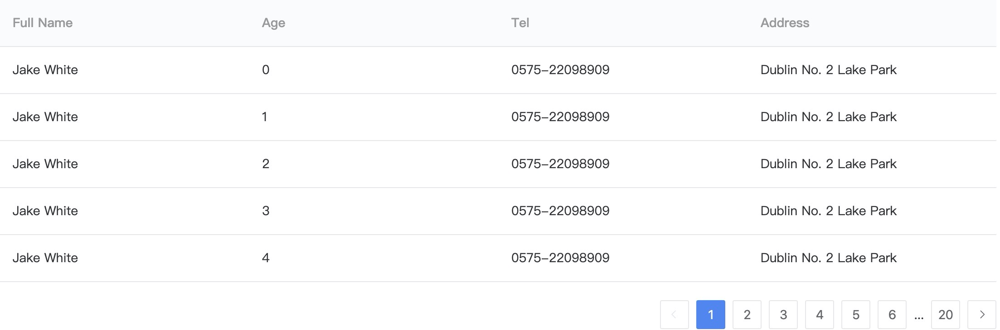

当表格数据较多时，可以通过设置 `pagination` 来将表格进行分页

```js
import Table from '../HiTable'
import React from 'react'

let data = []

for (let i = 0; i < 100; i++) {
  data.push({
    key: i,
    name: 'Jake White',
    age: i,
    tel: '0575-22098909',
    phone: 18900010002,
    address: 'Dublin No. 2 Lake Park'
  })
}

class Demo extends React.Component {
  constructor(props) {
    super(props)
    this.columns = [
      { title: 'Full Name', width: 100, dataKey: 'name', key: 'name' },
      { title: 'Age', width: 100, dataKey: 'age', key: 'age' },
      { title: 'Column 1', dataKey: 'address', key: '1' },
      { title: 'Column 2', dataKey: 'address2', key: '2' },
      { title: 'Column 3', dataKey: 'address3', key: '3' },
      { title: 'Column 4', dataKey: 'address4', key: '4' }
    ]
    this.state = {
      pageSize: 10,
      current: 1,
      data: []
    }
  }

  get total2() {
    return this.state.data.length
  }

  getData(current, pageSize) {
    let res = []
    let start = this.state.pageSize * (current - 1)
    let end = this.state.pageSize * current
    for (let i = start; i < end; i++) {
      res.push(data[i])
    }
    console.log(res, 'res--res')
    return res
  }

  componentDidMount() {
    this.setState({
      data: this.getData(2),
      current: 2
    })
  }

  set(current) {
    this.setState({ data: this.getData(current), current })
  }

  render() {
    return (
      <Table
        columns={this.columns}
        data={this.state.data}
        pagination={{
          pageSize: this.state.pageSize,
          total: data.length,
          current: this.state.current,
          onChange: (page, pre, size) => {
            console.log(page, pre, size)
            this.set(page)
          }
        }}
      />
    )
  }
}

export default Demo
```

### 表格吸顶

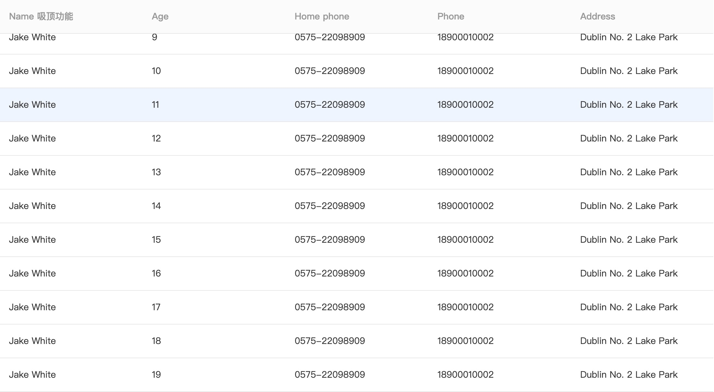

通过设置 `sticky` 使表格的头部到达浏览器视口顶端的是时候，开始吸附至浏览器顶端，直至表格整体从视口消失

```js
import Table from '../HiTable'
import React from 'react'

let columns = [
  {
    title: 'Name 吸顶功能',
    dataKey: 'name',
    key: 1
  },
  {
    title: 'Age',
    dataKey: 'age',
    key: 2,
    sorter(pre, next) {
      return pre.age - next.age
    }
  },
  {
    title: 'Home phone',
    colSpan: 2,
    dataKey: 'tel',
    key: 3
  },
  {
    title: 'Phone',
    colSpan: 0,
    dataKey: 'phone',
    key: 4
  },
  {
    title: 'Address',
    dataKey: 'address',
    key: 5
  }
]

let data = []

for (let i = 0; i < 20; i++) {
  data.push({
    key: i,
    name: 'Jake White',
    age: i,
    tel: '0575-22098909',
    phone: 18900010002,
    address: 'Dublin No. 2 Lake Park'
  })
}

export default function() {
  return <Table columns={columns} data={data} sticky />
}
```

### 树形表格

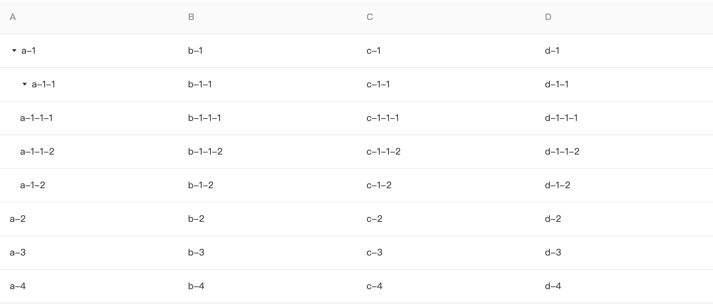

用于展示数据项中有层级关系的时候

```js
import React from 'react'
import Table from '../HiTable'

const TreeTable = () => {
  return (
    <div className='App' style={{ width: 1100, margin: '0 auto' }}>
      <h2>树形表格</h2>
      <div>
        <Table
          data={[
            {
              a: 'a-1',
              b: 'b-1',
              c: 'c-1',
              d: 'd-1',
              key: 1,
              children: [
                {
                  a: 'a-1-1',
                  b: 'b-1-1',
                  c: 'c-1-1',
                  d: 'd-1-1',
                  key: '1-1',
                  children: [
                    {
                      a: 'a-1-1-1',
                      b: 'b-1-1-1',
                      c: 'c-1-1-1',
                      d: 'd-1-1-1',
                      key: '1-1-1'
                    },
                    {
                      a: 'a-1-1-2',
                      b: 'b-1-1-2',
                      c: 'c-1-1-2',
                      d: 'd-1-1-2',
                      key: '1-1-2'
                    }
                  ]
                },
                { a: 'a-1-2', b: 'b-1-2', c: 'c-1-2', d: 'd-1-2', key: '1-2' }
              ]
            },
            { a: 'a-2', b: 'b-2', c: 'c-2', d: 'd-2', key: 2 },
            { a: 'a-3', b: 'b-3', c: 'c-3', d: 'd-3', key: 3 },
            { a: 'a-4', b: 'b-4', c: 'c-4', d: 'd-4', key: 4 }
          ]}
          columns={[
            { title: 'A', dataKey: 'a' },
            { title: 'B', dataKey: 'b' },
            { title: 'C', dataKey: 'c' },
            { title: 'D', dataKey: 'd' }
          ]}
        />
      </div>
    </div>
  )
}

export default TreeTable
```

### 合并单元格

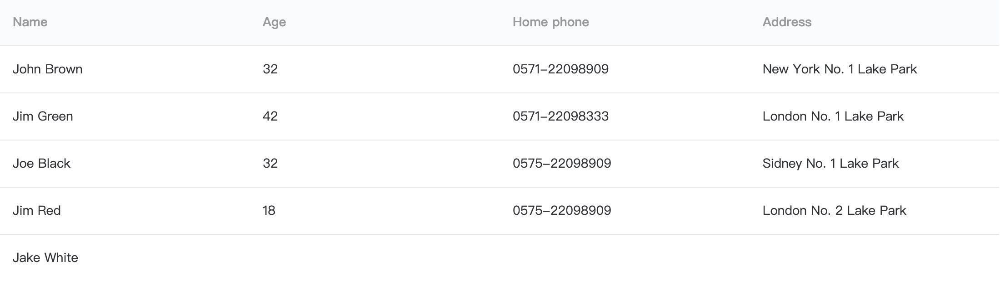

需要设置 `columns` 中对应列的 `render` 方法，返回一个如`{children: xx, colSpan:xx, rowSpan: xx}` 的数据结构来表示该单元格的合并方式

```js
import Table from '../HiTable'
import React from 'react'

const renderContent = (value, row, index) => {
  const obj = {
    children: value,
    props: {}
  }
  if (index === 4) {
    obj.props.colSpan = 0
  }
  return obj
}

let columns = [
  {
    title: 'Name',
    dataKey: 'name',
    render: (text, row, index) => {
      if (index < 4) {
        return <span>{text}</span>
      }
      return {
        children: <span>{text}</span>,
        props: {
          colSpan: 4
        }
      }
    },
    key: 1
  },
  {
    title: 'Age',
    dataKey: 'age',
    key: 2,
    render: renderContent
  },
  {
    title: 'Home phone',
    dataKey: 'tel',
    key: 3,
    render: renderContent
  },
  {
    title: 'Address',
    dataKey: 'address',
    render: renderContent,
    key: 4
  }
]

let data = [
  {
    key: '1',
    name: 'John Brown',
    age: 32,
    tel: '0571-22098909',
    address: 'New York No. 1 Lake Park'
  },
  {
    key: '2',
    name: 'Jim Green',
    tel: '0571-22098333',
    age: 42,
    address: 'London No. 1 Lake Park'
  },
  {
    key: '3',
    name: 'Joe Black',
    age: 32,
    tel: '0575-22098909',
    address: 'Sidney No. 1 Lake Park'
  },
  {
    key: '4',
    name: 'Jim Red',
    age: 18,
    tel: '0575-22098909',
    address: 'London No. 2 Lake Park'
  },
  {
    key: '5',
    name: 'Jake White',
    age: 18,
    tel: '0575-22098909',
    address: 'Dublin No. 2 Lake Park'
  }
]

const MergeCellTable = () => {
  return <Table columns={columns} data={data} />
}
export default MergeCellTable
```

### 固定表头

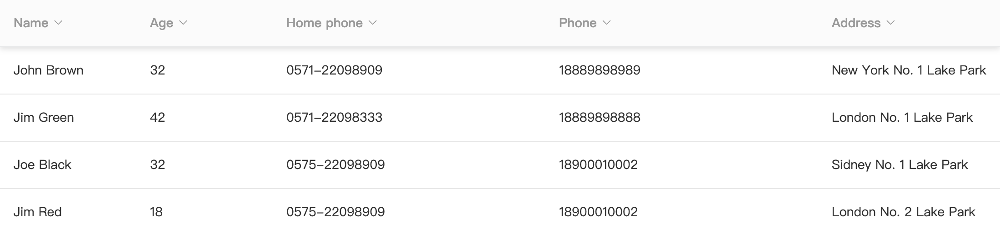

通过设置 `maxHeight` 来使表格头部固定，当表格主体内容高度大于 `maxHeight` 值时，表头将固定在表格顶部

```js
import Table from '../HiTable'
import React from 'react'

let columns = [
  {
    title: 'Name',
    dataKey: 'name',
    key: 1,
    width: 150
  },
  {
    title: 'Age',
    dataKey: 'age',
    key: 2,
    width: 150
  },
  {
    title: 'Home phone',
    colSpan: 2,
    dataKey: 'tel',
    key: 3,
    width: 300
  },
  {
    title: 'Phone',
    colSpan: 0,
    dataKey: 'phone',
    key: 4,
    width: 300
  },
  {
    title: 'Address',
    dataKey: 'address',
    key: 5,
    width: 300
  },
  {
    title: 'Address2',
    dataKey: 'address2',
    key: 6,
    width: 300
  }
]

let data = [
  {
    key: '1',
    name: 'John Brown',
    age: 32,
    tel: '0571-22098909',
    phone: 18889898989,
    address: 'New York No. 1 Lake Park',
    address2: 'New York No. 1 Lake Park'
  },
  {
    key: '2',
    name: 'Jim Green',
    tel: '0571-22098333',
    phone: 18889898888,
    age: 42,
    address: 'London No. 1 Lake Park',
    address2: 'New York No. 1 Lake Park'
  },
  {
    key: '3',
    name: 'Joe Black',
    age: 32,
    tel: '0575-22098909',
    phone: 18900010002,
    address: 'Sidney No. 1 Lake Park',
    address2: 'New York No. 1 Lake Park'
  },
  {
    key: '4',
    name: 'Jim Red',
    age: 18,
    tel: '0575-22098909',
    phone: 18900010002,
    address: 'London No. 2 Lake Park',
    address2: 'New York No. 1 Lake Park'
  },
  {
    key: '5',
    name: 'Jake White',
    age: 18,
    tel: '0575-22098909',
    phone: 18900010002,
    address: 'Dublin No. 2 Lake Park',
    address2: 'New York No. 1 Lake Park'
  }
]

const FixedHeaderTable = () => {
  return <Table columns={columns} data={data} maxHeight={200} showColMenu />
}

export default FixedHeaderTable
```

### 列冻结


适用于列较多，需要某些列固定以方便查看表格数据的场景，需要设置 `fixedToColumn` 来确定固定至的列

```js
import Table from '../HiTable'
import React from 'react'

let columns = [
  {
    title: 'Name',
    dataKey: 'name',
    key: 1,
    width: 150
  },
  {
    title: 'Age',
    dataKey: 'age',
    key: 2,
    width: 150
  },
  {
    title: 'Home phone',
    colSpan: 2,
    dataKey: 'tel',
    key: 3,
    width: 300
  },
  {
    title: 'Phone',
    colSpan: 0,
    dataKey: 'phone',
    key: 4,
    width: 300
  },
  {
    title: 'Address',
    dataKey: 'address',
    key: 5,
    width: 300
  },
  {
    title: 'Address2',
    dataKey: 'address2',
    key: 6,
    width: 300
  }
]

let data = [
  {
    key: '1',
    name: 'John Brown',
    age: 32,
    tel: '0571-22098909',
    phone: 18889898989,
    address: 'New York No. 1 Lake Park',
    address2: 'New York No. 1 Lake Park'
  },
  {
    key: '2',
    name: 'Jim Green',
    tel: '0571-22098333',
    phone: 18889898888,
    age: 42,
    address: 'London No. 1 Lake Park',
    address2: 'New York No. 1 Lake Park'
  },
  {
    key: '3',
    name: 'Joe Black',
    age: 32,
    tel: '0575-22098909',
    phone: 18900010002,
    address: 'Sidney No. 1 Lake Park',
    address2: 'New York No. 1 Lake Park'
  },
  {
    key: '4',
    name: 'Jim Red',
    age: 18,
    tel: '0575-22098909',
    phone: 18900010002,
    address: 'London No. 2 Lake Park',
    address2: 'New York No. 1 Lake Park'
  },
  {
    key: '5',
    name: 'Jake White',
    age: 18,
    tel: '0575-22098909',
    phone: 18900010002,
    address: 'Dublin No. 2 Lake Park',
    address2: 'New York No. 1 Lake Park'
  }
]

const FixedTable = () => {
  return (
    <Table
      columns={columns}
      data={data}
      maxHeight={200}
      fixedToColumn={'age'}
    />
  )
}

export default FixedTable
```

### 表头分组

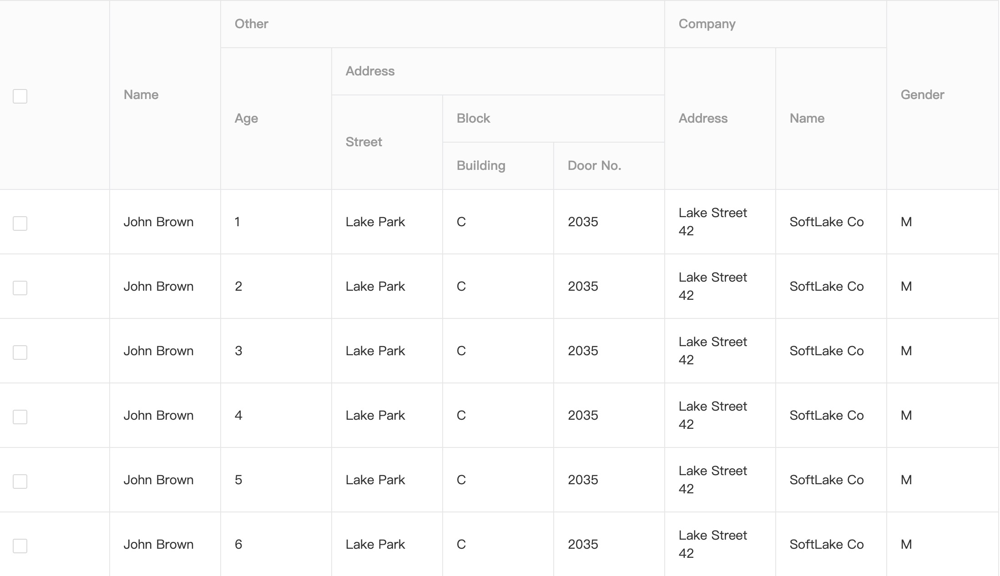
通过设置 `columns` 中每列的 `children` 来表示表头间的层级关系

```js
import React from 'react'
import Table from '../HiTable'

let columns = [
  {
    title: 'Name',
    dataKey: 'name',
    key: '1'
  },
  {
    title: 'Other',

    children: [
      {
        title: 'Age',
        dataKey: 'age',
        key: 2
      },
      {
        title: 'Address',

        children: [
          {
            title: 'Street',
            dataKey: 'street',
            key: '3'
          },
          {
            title: 'Block',
            children: [
              {
                title: 'Building',
                dataKey: 'building',
                key: '4'
              },
              {
                title: 'Door No.',
                dataKey: 'number',
                key: '5'
              }
            ]
          }
        ]
      }
    ]
  },
  {
    title: 'Company',
    key: '6',
    children: [
      {
        title: 'Address',
        dataKey: 'companyAddress',
        key: '7'
      },
      {
        title: 'Name',
        dataKey: 'companyName',
        key: '8'
      }
    ]
  },
  {
    title: 'Gender',
    dataKey: 'gender',
    key: '9'
  }
]
let data = []
for (let i = 0; i < 6; i++) {
  data.push({
    key: i,
    name: 'John Brown',
    age: i + 1,
    street: 'Lake Park',
    building: 'C',
    number: 2035,
    companyAddress: 'Lake Street 42',
    companyName: 'SoftLake Co',
    gender: 'M'
  })
}

export default function MultiHeaderTable() {
  return <Table columns={columns} data={data} />
}
```

### 内嵌式

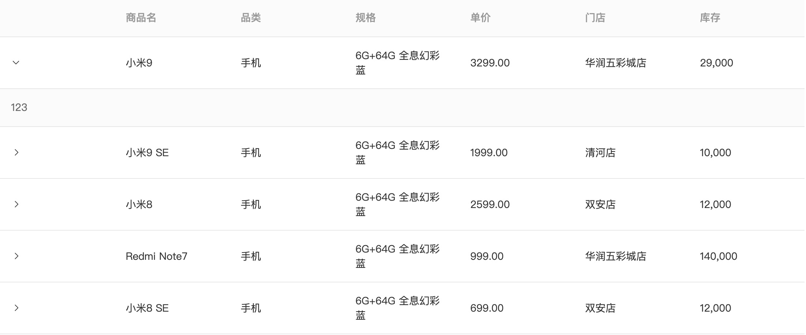

当表格信息不能一次性展示完全时，可以通过 `expandedRender` 来渲染内嵌信息

```js
import Table from '@mi/power-table'
import React from 'react'

let columns = [
  {
    title: '商品名',
    dataKey: 'name'
  },
  {
    title: '品类',
    dataKey: 'type'
  },
  {
    title: '规格',
    dataKey: 'size'
  },
  {
    title: '单价',
    dataKey: 'price'
  },
  {
    title: '门店',
    dataKey: 'address'
  },
  {
    title: '库存',
    dataKey: 'stock'
  }
]

let data = [
  {
    name: '小米9',
    type: '手机',
    size: '6G+64G 全息幻彩蓝',
    price: '3299.00',
    address: '华润五彩城店',
    stock: '29,000',
    key: 1
  },
  {
    name: '小米9 SE',
    type: '手机',
    size: '6G+64G 全息幻彩蓝',
    price: '1999.00',
    address: '清河店',
    stock: '10,000',
    key: 2
  },
  {
    name: '小米8',
    type: '手机',
    size: '6G+64G 全息幻彩蓝',
    price: '2599.00',
    address: '双安店',
    stock: '12,000',
    key: 3
  },
  {
    name: 'Redmi Note7',
    type: '手机',
    size: '6G+64G 全息幻彩蓝',
    price: '999.00',
    address: '华润五彩城店',
    stock: '140,000',
    key: 4
  },
  {
    name: '小米8 SE',
    type: '手机',
    size: '6G+64G 全息幻彩蓝',
    price: '699.00',
    address: '双安店',
    stock: '12,000',
    key: 5
  }
]
const RowExpandedTable = () => {
  return (
    <div style={{ width: 1100, margin: '0 auto' }}>
      <h2>内嵌式</h2>
      <Table
        columns={columns}
        data={data}
        expandedRender={() => {
          return <div>123</div>
        }}
      />
    </div>
  )
}

export default RowExpandedTable
```

### 动态调整列宽

通过设置 `resizable` 使列可以动态调整宽度

```js
import Table from '../HiTable'
import React, { useRef, useState } from 'react'
import { Button, Popper, Switch, Icon } from '@hi-ui/hiui'
import { DragDropContext, Droppable, Draggable } from 'react-beautiful-dnd'

let columns = [
  {
    title: '商品名',
    dataKey: 'name',
    width: 150
  },
  {
    title: '品类',
    dataKey: 'type',
    width: 150
  },
  {
    title: '规格',
    dataKey: 'size',
    width: 300
  },
  {
    title: '单价',
    dataKey: 'price',
    width: 300,
    sorter(pre, next) {
      return pre.price - next.price
    }
  },
  {
    title: '门店xxxxxx',
    dataKey: 'address',
    width: 300
  },
  {
    title: '库存',
    dataKey: 'stock',
    width: 300
  }
]

let data = [
  {
    name: '小米9',
    type: '手机',
    size: '6G+64G 全息幻彩蓝',
    price: 3299,
    address: '华润五彩城店',
    stock: '29,000',
    key: 1
  },
  {
    name: '小米9 SE',
    type: '手机',
    size: '6G+64G 全息幻彩蓝',
    price: 1999,
    address: '清河店',
    stock: '10,000',
    key: 2
  },
  {
    name: '小米8',
    type: '手机',
    size: '6G+64G 全息幻彩蓝',
    price: 2599,
    address: '双安店',
    stock: '12,000',
    key: 3
  },
  {
    name: 'Redmi Note7',
    type: '手机',
    size: '6G+64G 全息幻彩蓝',
    price: 999,
    address: '华润五彩城店',
    stock: '140,000',
    key: 4
  },
  {
    name: '小米8 SE',
    type: '手机',
    size: '6G+64G 全息幻彩蓝',
    price: 699,
    address: '双安店',
    stock: '12,000',
    key: 5
  }
]

const DynamicTable = () => {
  return (
    <Table uniqueId='666' columns={columns} data={data} bordered resizable />
  )
}

export default DynamicTable
```

### 控制面板集成

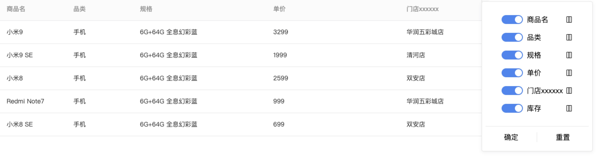

通过设置 `setting` 来开启控制面板功能，在控制面板中可以调整列的顺序，控制列的显示和隐藏

```js
import Table from '../HiTable'
import React from 'react'

let columns = [
  {
    title: '商品名',
    dataKey: 'name',
    width: 150
  },
  {
    title: '品类',
    dataKey: 'type',
    width: 150
  },
  {
    title: '规格',
    dataKey: 'size',
    width: 300
  },
  {
    title: '单价',
    dataKey: 'price',
    width: 300,
    sorter(pre, next) {
      return pre.price - next.price
    }
  },
  {
    title: '门店xxxxxx',
    dataKey: 'address',
    width: 300
  },
  {
    title: '库存',
    dataKey: 'stock',
    width: 300
  }
]

let data = [
  {
    name: '小米9',
    type: '手机',
    size: '6G+64G 全息幻彩蓝',
    price: 3299,
    address: '华润五彩城店',
    stock: '29,000',
    key: 1
  },
  {
    name: '小米9 SE',
    type: '手机',
    size: '6G+64G 全息幻彩蓝',
    price: 1999,
    address: '清河店',
    stock: '10,000',
    key: 2
  },
  {
    name: '小米8',
    type: '手机',
    size: '6G+64G 全息幻彩蓝',
    price: 2599,
    address: '双安店',
    stock: '12,000',
    key: 3
  },
  {
    name: 'Redmi Note7',
    type: '手机',
    size: '6G+64G 全息幻彩蓝',
    price: 999,
    address: '华润五彩城店',
    stock: '140,000',
    key: 4
  },
  {
    name: '小米8 SE',
    type: '手机',
    size: '6G+64G 全息幻彩蓝',
    price: 699,
    address: '双安店',
    stock: '12,000',
    key: 5
  }
]

const SettingTable = () => {
  return (
    <div style={{ width: 1100, margin: '0 auto' }}>
      <Table uniqueId='666' columns={columns} data={data} setting />
    </div>
  )
}

export default SettingTable
```

### 标准模式

通过设置 `standard` 来快速同时开启 `showColMenu = true, sticky = true, bordered = true, setting = true, striped = true`

```js
import Table from '../HiTable'
import React from 'react'

let columns = [
  {
    title: '商品名',
    dataKey: 'name',
    width: 150
  },
  {
    title: '品类',
    dataKey: 'type',
    width: 150
  },
  {
    title: '规格',
    dataKey: 'size',
    width: 300
  },
  {
    title: '单价',
    dataKey: 'price',
    width: 300,
    sorter(pre, next) {
      return pre.price - next.price
    }
  },
  {
    title: '门店xxxxxx',
    dataKey: 'address',
    width: 300
  },
  {
    title: '库存',
    dataKey: 'stock',
    width: 300
  }
]

let data = [
  {
    name: '小米9',
    type: '手机',
    size: '6G+64G 全息幻彩蓝',
    price: 3299,
    address: '华润五彩城店',
    stock: '29,000',
    key: 1
  },
  {
    name: '小米9 SE',
    type: '手机',
    size: '6G+64G 全息幻彩蓝',
    price: 1999,
    address: '清河店',
    stock: '10,000',
    key: 2
  },
  {
    name: '小米8',
    type: '手机',
    size: '6G+64G 全息幻彩蓝',
    price: 2599,
    address: '双安店',
    stock: '12,000',
    key: 3
  },
  {
    name: 'Redmi Note7',
    type: '手机',
    size: '6G+64G 全息幻彩蓝',
    price: 999,
    address: '华润五彩城店',
    stock: '140,000',
    key: 4
  },
  {
    name: '小米8 SE',
    type: '手机',
    size: '6G+64G 全息幻彩蓝',
    price: 699,
    address: '双安店',
    stock: '12,000',
    key: 5
  }
]

const StandardTable = () => {
  return (
    <div style={{ width: 1100, margin: '0 auto' }}>
      <Table columns={columns} data={data} standard />
    </div>
  )
}

export default StandardTable
```

## API

### Props

| 属性名             | 描述                                                                                                    | 类型                                           | 可选值                                    | 默认值    |
| ------------------ | ------------------------------------------------------------------------------------------------------- | ---------------------------------------------- | ----------------------------------------- | --------- |
| data               | 表格数据                                                                                                | object[]                                       | -                                         | -         |
| columns            | 表格列配置信息                                                                                          | ColumnItem[]                                   | -                                         | -         |
| bordered           | 是否显示边框（表头分组模式下，表格自带边框）                                                            | boolean                                        | true \| false                             | false     |
| sticky             | 是否支持表头吸顶                                                                                        | boolean                                        | true \| false                             | false     |
| highlightedColKeys | 高亮列（受控）                                                                                          | string[]                                       | -                                         | []        |
| expandedRender     | 表格展开项                                                                                              | (record: dataItem, index: number) => ReactNode | -                                         | -         |
| maxHeight          | 表格最大高度，当穿过该高度时，展示滚动条且表头固定                                                      | number                                         | -                                         | -         |
| fixedToColumn      | 表格列冻结设置，为 string 时仅支持从左侧冻结至某一列                                                    | string \| FixedOption                          | -                                         | null      |
| size               | 配置表格尺寸                                                                                            | string                                         | 'large' \| 'default' \| 'small' \| 'mini' | 'default' |
| pagination         | 表格分页配置项                                                                                          | Pagination                                     | -                                         | null      |
| errorRowKeys       | 错误列（受控）                                                                                          | string[]                                       | -                                         | []        |
| highlightedRowKeys | 高亮行（受控）                                                                                          | string[]                                       | -                                         | []        |
| rowSelection       | 行可选（受控）                                                                                          | RowSelection                                   | -                                         | null      |
| dataSource         | 异步数据源                                                                                              | (current: number) => DataSource                | -                                         | null      |
| showColMenu        | 是否支持列操作                                                                                          | boolean                                        | -                                         | false     |
| striped            | 是否展示为斑马纹效果                                                                                    | boolean                                        | -                                         | false     |
| setting            | 是否集成控制面板功能                                                                                    | boolean                                        | -                                         | false     |
| resizable          | 是否能够动态控制列宽                                                                                    | boolean                                        | true \| false                             | false     |
| standard           | 标准模式，默认集成 `showColMenu = true, sticky = true, bordered = true, setting = true, striped = true` | boolean                                        | true \| false                             | false     |

### Type: ColumnItem

| 参数     | 说明                   | 类型                                                                             | 可选值            | 默认值 |
| -------- | ---------------------- | -------------------------------------------------------------------------------- | ----------------- | ------ |
| title    | 列标题                 | string                                                                           | -                 | -      |
| dataKey  | 列对应数据项的唯一标识 | string \| number                                                                 | -                 | -      |
| align    | 列对齐方式             | string                                                                           | 'left' \| 'right' | 'left' |
| sorter   | 列排序函数             | () => boolean                                                                    | -                 | null   |
| avg      | 该列是否支持平均值     | boolean                                                                          | -                 | false  |
| total    | 该列是否支持合计       | boolean                                                                          | -                 | false  |
| width    | 该列宽度               | number                                                                           | -                 | -      |
| children | 多级表头               | ColumnItem[]                                                                     | -                 | -      |
| render   | 控制单元格自定义渲染   | (text: DataItem[ColumnItem[dataKey]], row: DataItem, index: number) => ReactNode | -                 | -      |

### Type: DataSource

| 参数              | 说明                                      | 类型                              | 可选值                                             | 默认值        |
| ----------------- | ----------------------------------------- | --------------------------------- | -------------------------------------------------- | ------------- |
| url               | 请求的 url                                | string                            | -                                                  | -             |
| type              | 请求方法                                  | string                            | get \| post                                        | get           |
| data              | post 请求时请求体参数                     | object                            | -                                                  | -             |
| params            | url 查询参数                              | object                            | -                                                  | -             |
| headers           | 请求头                                    | object                            | -                                                  | -             |
| mode              | 请求模式                                  | string                            | 'same-origin' \| 'cors' \| 'no-cors' \| 'navigate' | 'same-origin' |
| transformResponse | 成功时的回调，需要返回注入 table 的配置项 | (response: object) => TableConfig | -                                                  | -             |

### Type: Pagination

| 参数             | 说明                                                       | 类型                                                      | 可选值                            | 默认值    |
| ---------------- | ---------------------------------------------------------- | --------------------------------------------------------- | --------------------------------- | --------- |
| type             | 分页的类型                                                 | string                                                    | 'default' \| 'simple' \| 'shrink' | 'default' |
| defaultCurrent   | 默认的当前页数                                             | number                                                    | -                                 | 1         |
| current          | 当前页数                                                   | number                                                    | -                                 | -         |
| max              | 最大显示的页数                                             | number                                                    | -                                 | 2         |
| pageSize         | 每页条数                                                   | number                                                    | -                                 | 10        |
| pageSizeOptions  | 指定每页可以显示多少条                                     | number[]                                                  | -                                 | []        |
| total            | 数据总数                                                   | number                                                    | -                                 | -         |
| autoHide         | 只有一页时是否隐藏分页器                                   | boolean                                                   | true \| false                     | false     |
| showJumper       | 是否显示跳转                                               | boolean                                                   | true \| false                     | false     |
| onJump           | 快速跳转时触发，回调值为当前页数                           | (current: number) => void                                 | -                                 | -         |
| onChange         | 页码改变时的回调，回调值为当前页数、之前的页数和每页条数   | (current: number, prev: number, pageSize: number) => void | -                                 | -         | - |
| onPageSizeChange | 每页显示条数改变的回调函数，返回改变后的每页条数及当前页数 | (current: number, pageSize: number) => void               | -                                 | -         | - |

### Type: FixedOption

| 参数  | 说明                 | 类型   | 可选值 | 默认值 |
| ----- | -------------------- | ------ | ------ | ------ |
| left  | 表格从左侧冻结至某列 | string | -      | -      |
| right | 表格从右侧冻结至某列 | string | -      | -      |
